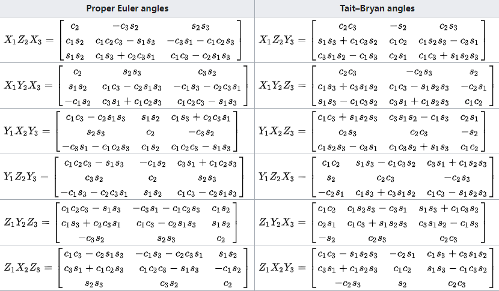
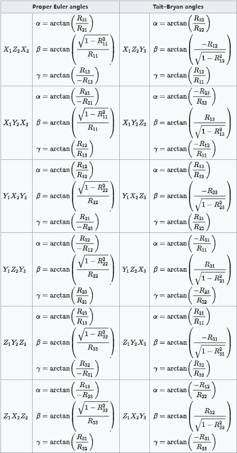
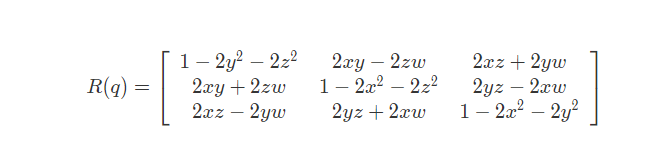
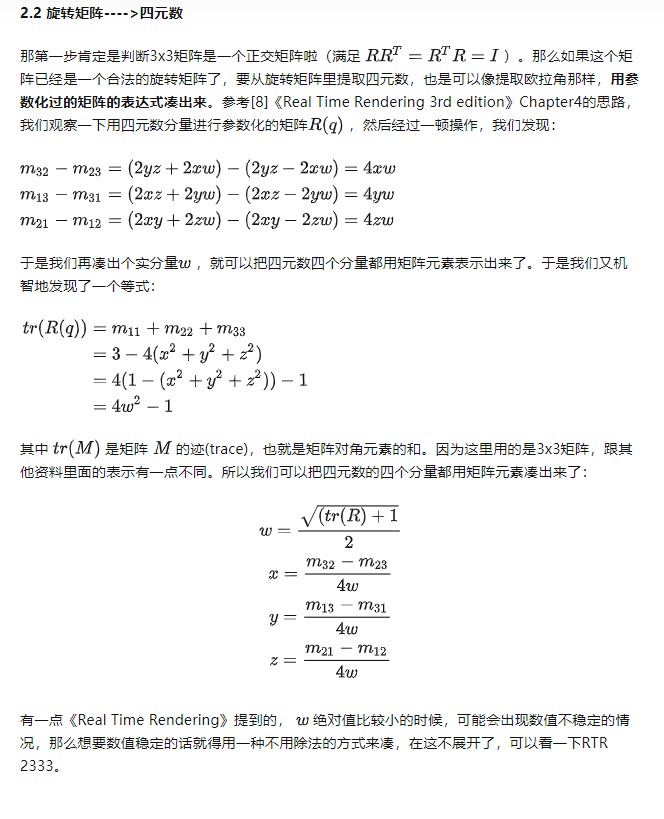
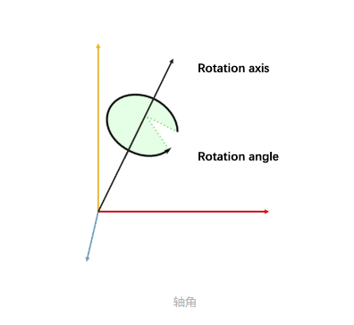
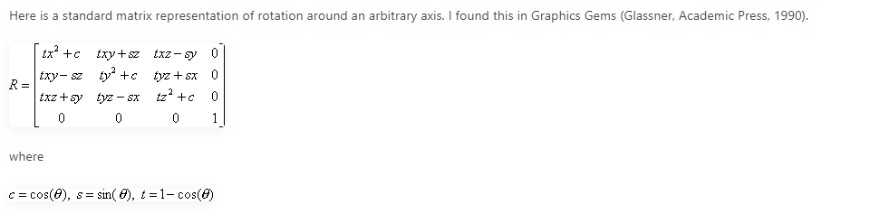

### CSS3D_orthographic 所笔记相关的知识点

1. 计算机图形学里面的旋转。
2. three.js 里面 是基于哪种方式 实现的旋转？

#### 参考文章
1.[三维旋转：欧拉角，四元数，旋转矩阵，轴角之间的转换](https://zhuanlan.zhihu.com/p/45404840)

2.[如何用仿射变换来移动和旋转3D物体](https://time.geekbang.org/column/article/271842?cid=100053801)

3.[Rotation matrix](https://en.wikipedia.org/wiki/Rotation_matrix)

4.[四元数与三维旋转](https://krasjet.github.io/quaternion/quaternion.pdf)

5.[Euler angles](https://en.wikipedia.org/wiki/Euler_angles)

6.[Do we Really need Quaternions?](https://www.gamedev.net/reference/articles/article1199.asp)

### 相关知识点笔记
##### tip：参考系--在介绍旋转之前，需要说一说 参考系。 
##### 参考系：在物体运动的空间中，都需要选择一个 相对参考系(相对物体不做运动的物体或者坐标系) 来对照 物体的运动。
##### 参考系：(百度百科)--参考系又称参照物，物理学名词，指 研究物体运动时所选定的参照物体或彼此不作相对运动的物体系。
##### 参考系的选择：1，事先假定参考系不动。2，选择不同的参考系，结果会有所不同。
##### 参考系的选择：3，参考系的选取时任意的。4，要在同一个参考系中。
1. 图形学里的旋转方式很多，大致有四种，three.js 也采用了这四种分别是--欧拉角，四元数，旋转矩阵，轴-角。
   
1.1 欧拉角：欧拉角是 描述 三维物体 在空间中 取向 的标准数学模型，也是 航空航天普遍采用的标准；
           对于在三维空间里的 一个参考系，任何坐标系的取向，都可以用三个欧拉角来表示。

1.2 欧拉角的公式：M=Ry​×Rx​×Rz(是按照 y-x-z 顺规表示的, 不同顺规只是矩阵相乘的顺序不同)，Ry​ Rx​ Rz 分别表示 绕 y x z 三轴旋转的矩阵。

1.2.1 欧拉角的顺规：欧拉角有两种顺规--Proper Euler angles 和 Tait-Bryan angles，分别都有6种，共12种。

1.2.2 Proper Euler angles：(有两个轴相同的顺规) z-x-z, z-y-z, x-y-x, x-z-x, y-z-y, y-x-y。

1.2.3 Tait-Bryan angles：(三个轴都不同的顺规) x-y-z, x-z-y, y-z-x, y-x-z, z-x-y, z-y-x。

1.2.4 欧拉角的问题：万向节死锁--(xyz顺规为例)简单来说就是 绕x轴的β角度到达 90或者-90 的时候
                   这时 不管怎么改变 绕y轴的角度还是绕z轴的角度，物体都绕着 y轴旋转

1.2.5 万向节锁的现象：只要是欧拉角，都存在 万向节锁的问题，这是由 cos90°和cos-90° 引起的，四元数可以解决这个问题。

1.3.1 旋转矩阵：上面欧拉角在相应顺规的结果 就是 旋转矩阵
               而 旋转矩阵 -> 欧拉角 就是逆着来的，通过旋转矩阵计算 相应的欧拉角。

1.3.2 欧拉角 -> 旋转矩阵 以及 旋转矩阵 -> 欧拉角 不同顺规的转换方式可以 参考下面两张图。



1.4 四元数：四元数是一种 高阶复数，可以表示为-- q = w + xi + yj + zk;
           其中：i,j,k是三个虚数单位,w 是标量，满足 i*i = j*j = k*k = i*j*k = −1;
           如果把 xi + yj + zk 看成是一个 三维向量 v，那么 q = (v, w);
           如果用四元数来描述 3D旋转，其中参数满足 x*x + y*y + z*z + w*w = 1

1.4.1 四元数 -> 旋转矩阵(具体转换可以[点击这里](https://krasjet.github.io/quaternion/quaternion.pdf)) 见下图


1.4.2 旋转矩阵 -> 四元数--类似于旋转矩阵到欧拉角的转换，根据矩阵提取 四元数的参数，具体见下图。


1.5 轴角--(上个例子中有用到：new THREE.Matrix4().makeRotationAxis(axis, angles))
          在三维空间中，给定一个由单位向量表示的轴，以及一个旋转角度 α，以此来表示 几何体绕该轴旋转 α角
          绕单位向量 u 旋转 α角，对应 四元数表示为：q = ( u * sin(α / 2), cos(α / 2) )


1.5.1 轴角 -> 旋转矩阵 见下图有具体公式


1.6 还有 旋转矩阵 -> 四元数 和 四元数 -> 欧拉角 的相关转换的具体公式可以参考[第一篇文章](https://zhuanlan.zhihu.com/p/45404840)

1. three.js 是基于 四元数quaternion 实现几何体旋转的--可以在 class Object 的 updateMatrix() 方法中看到
   而且会定义一个 欧拉角的 rotation，quaternion或者rotation每次改变的时候，他们都会在彼此的监听函数中重新计算
```javascript
  function onRotationChange() { quaternion.setFromEuler(rotation, false) }
  function onQuaternionChange() { rotation.setFromQuaternion(quaternion, undefined, false) }

  rotation._onChange(onRotationChange)
  quaternion._onChange(onQuaternionChange)

  // rotation 和 quaternion 的类方法里 都有一个 _onChange() 钩子，每次在他们值或被copy的时候都会执行上面的 代码
  
  _onChange(callback) {
    this._onChangeCallback = callback;
    return this;
  }
	_onChangeCallback() {}
```