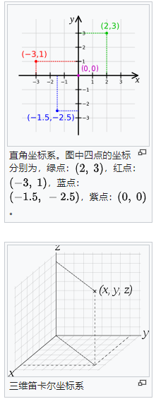
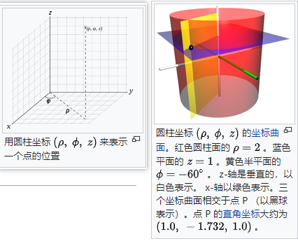
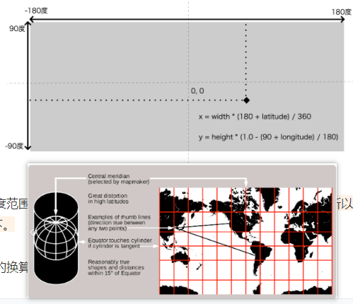
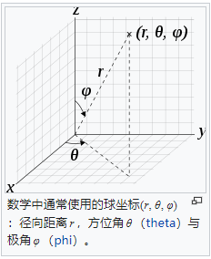

### CSS3D_periodictable 所笔记相关的知识点

1. 直角坐标系，极坐标系，圆柱坐标系(墨卡托投影)，球体坐标系的相关概念及他们之间的相互转换方式

#### 参考文章
1. [笛卡尔坐标系](https://zh.wikipedia.org/zh-sg/%E7%AC%9B%E5%8D%A1%E5%B0%94%E5%9D%90%E6%A0%87%E7%B3%BB)
   
2. [圆柱坐标系](https://zh.wikipedia.org/zh-sg/%E5%9C%93%E6%9F%B1%E5%9D%90%E6%A8%99%E7%B3%BB)

3. [球坐标系](https://zh.wikipedia.org/wiki/%E7%90%83%E5%BA%A7%E6%A8%99%E7%B3%BB)

4. [如何实现地理信息可视化](https://time.geekbang.org/column/article/292607)

5. [如何用极坐标系绘制有趣图案](https://time.geekbang.org/column/article/266346)

### 相关知识点笔记
##### tip：上面几个坐标系基本上都会涉及到 两个专业名词-- 极角φ(phi) 和 方位角θ(theta)
##### 极角与方位角的取值范围：极角->[0, 2Π), 方位角->[0, Π)
##### 极角φ：表示 原点到 p点的连线 在 xy平面上的投影线，与 正x轴的夹角，取值范围 [0, 2Π)
##### 方位角θ：表示 原点到 p点的连线 与 正z轴的夹角，取值范围 [0, 2Π]
##### three.js里面的极角Φ：表示 原点到 p点的连线 在 xz平面(上面是xy平面)上的投影线, 与 正Z(上面是X)轴的夹角
##### three.js里面的方位角θ: 表示 原点到 p点的连线 与 Y轴(上面是z轴)正方向的夹角

1.1 直角坐标系：也被称为笛卡尔坐标系，分为 二维直角坐标系(x, y)和三维直角坐标系(x, y, z)，满足右手定则


1.2 极坐标系：Polar Coordinate System 是一个二维坐标系统。
             该坐标系统中的 任意位置 可由一个夹角(极角φ)和一段相对原点的距离来表示--(p，φ)。

1.2.1 二维直角坐标系 -> 极坐标系：(x, y) -> (Math.sqrt(x*x + y*y), Math.atan2(y, x))

1.2.2 极坐标系 -> 二维直角坐标系：(p, φ) -> (p * Math.cos(φ), p * Math.sin(φ))

1.3 圆柱坐标系：Cylindrical Coordinate System是一种三维坐标系，二维极角坐标系顺着 Z轴 延申，就得到了圆柱坐标系。


1.3.1 墨卡托投影：Mecator Projection 又称为 正轴等角圆柱投影，是一种等角的圆柱形地图投影，是一种最简单的地图投影方式。大致思路就是 把地球从南北两极往外扩，先变成一个圆柱体，然后将圆柱体的侧面展开，自然就将经纬度投影到平面上了。下图有 由 墨卡托投影 -> 二维直角坐标系的转换公式


1.3.2 三维直角坐标系 -> 圆柱坐标系：(x, y, z) -> (Math.sqrt(x*x + y*y), Math.atan2(y, x), z)

1.3.3 圆柱坐标系 -> 三维直角坐标系：(ρ, Φ, z) -> (ρ*Math.cos(Φ), ρ*Math.sin(Φ), z)
```javascript
// 下面是 three.js 里面的 圆柱坐标系->webGL坐标系的转换
// 这里 把极角写成了 theta，应该是作者喜好吧(维基百科上都是 phiΦ)
setFromCylindricalCoords(radius, theta, y) {
  this.x = radius * Math.sin(theta);
  this.y = y;
  this.z = radius * Math.cos(theta);
  return this;
}
```

1.4 球坐标系：Spherical Coordinate System 是数学上利用 球坐标(r, θ, φ) 表示一个点P在三维空间的位置的 三维正交坐标系，θ表示 P与球心的连线 与Z轴正方向的夹角(方位角)，φ表示 p与球心连线在 xy平面上的投影线 与 X轴正方向的夹角(极角)


1.4.1 三维直角坐标系 -> 球坐标系：(x, y, z) -> (Math.sqrt(x*x + y*y + z*z), Math.acos(z / r), Math.acos(x/rMath.sin(θ)))

1.4.2 球坐标系 -> 三维直角坐标系：(r, θ, φ) -> (r*Math.sin(θ)*Math.cos(φ), r*Math.sin(θ)*Math.sin(φ), r*Math.cos(θ))

1.4.3 上面的转换方式 是按照 Z轴朝上，X轴朝外，y轴朝右的 坐标系(不知道符合哪手坐标系)转换的，
      而在webGL图形学里使用的是 右手坐标系，因此他转换的方式是下面代码这样
```javascript
// 把三个轴调换过来之后就是下面代码样子：
// three.js 的 极角与方位角 在上面 tip里面说过。
// three.js 里面的 极角(倾斜角)与方位角的书写顺序与 上面的不同，这是由作者的喜欢定义的吧！
setFromSphericalCoords(radius, phi, theta) {
  const sinPhiRadius = Math.sin(phi) * radius;
  this.x = sinPhiRadius * Math.sin(theta);
  this.y = Math.cos(phi) * radius;
  this.z = sinPhiRadius * Math.cos(theta);
  return this;
}
```

1.4.4 圆柱坐标系 -> 球坐标系：(ρ, Φ, z) -> (Math.sqrt(ρ*ρ + z*z), Math.atan2(ρ, z), Φ)

1.4.5 球坐标系 -> 圆柱坐标系：(r, θ, Φ) -> (r*Math.sin(θ), Φ, r*Math.cos(θ))
